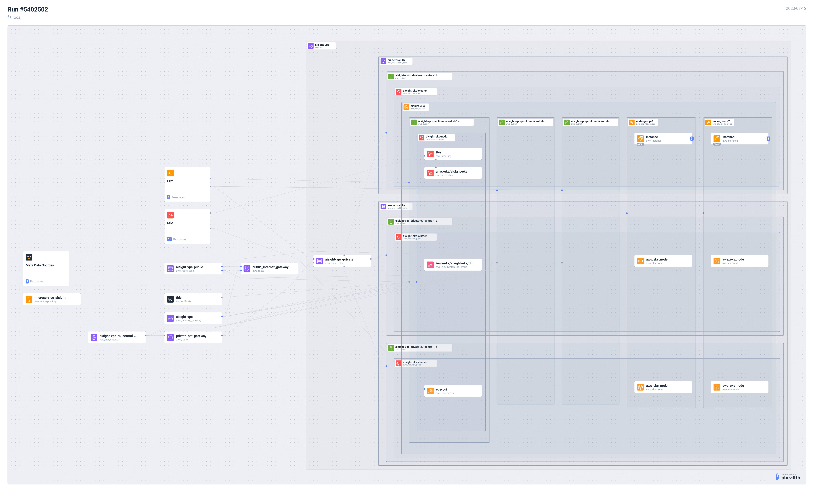

# Project Title

Python Flask API with POSTGRESQL database running in containers on AWS EKS cluster

## Project Description

This project is a simple demonstration of a Python Flask API that stores simple messages to a POSTGRESQL database. The API and database run in containers and are deployed on an AWS EKS cluster using a GitHub Actions CICD pipeline and Terraform for infrastructure provisioning. The Docker images are stored on AWS ECR and Kubernetes is used to manage container orchestration.

## Project Structure

The project has the following structure:

```bash
.
├── MicroService
│ ├── app.py
│ ├── Dockerfile
│ └── docker-compose.yml
│ └── ...
├── IaC
│ ├── main.tf
│ └── resources.tf
│ └── ...
├── .github/workflows
│ └── pipeline.yml
├── Kubernetes
│ ├── deployment.yml
│ └── service.yml
│ └── ...
└── README.md
└── AWS Network Diagram.pdf
```

### MicroService Folder

The `MicroService` folder contains the Flask API along with its Dockerfile and Docker Compose file.

- `app.py`: The Python Flask API code
- `Dockerfile`: The Dockerfile for building the API Docker image
- `docker-compose.yml`: The Docker Compose file for running the API and the database together in containers

### IaC Folder

The `IaC` folder contains the Terraform scripts to provision ECR and AWS EKS cluster.

- `resources.tf`: The Terraform script to create an ECR repository and EKS Cluster for storing Docker images and running

### .github/workflows Folder

The `.github/workflows` folder contains the CICD pipeline to build the Docker images and push them to ECR and deploy Kubernetes configuration files.

- `pipeline.yml`: The GitHub Actions pipeline file for building and deploying the Docker images to ECR and Kubernetes.

### Kubernetes Folder

The `Kubernetes` folder contains the deployment files for the application.

- `deployment.yml`: The Kubernetes deployment file for the API
- `service.yml`: The Kubernetes service file for exposing the API to the Internet.

## Infrastructure Diagram

Pluralith was used to create the infrastructure diagram for the project.



## Usage

To run the application locally, you can use Docker Compose:

```bash
cd MicroService/
docker-compose up
```
To deploy the application on AWS EKS cluster, you can use the GitHub Actions CICD pipeline and Terraform scripts in the IaC folder.